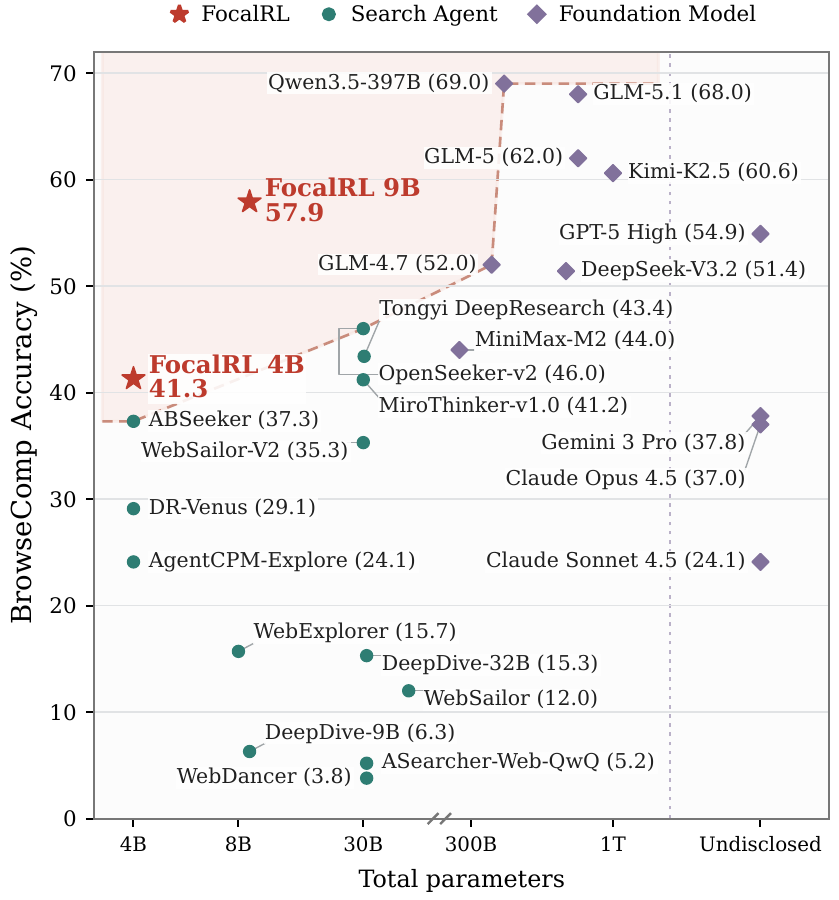
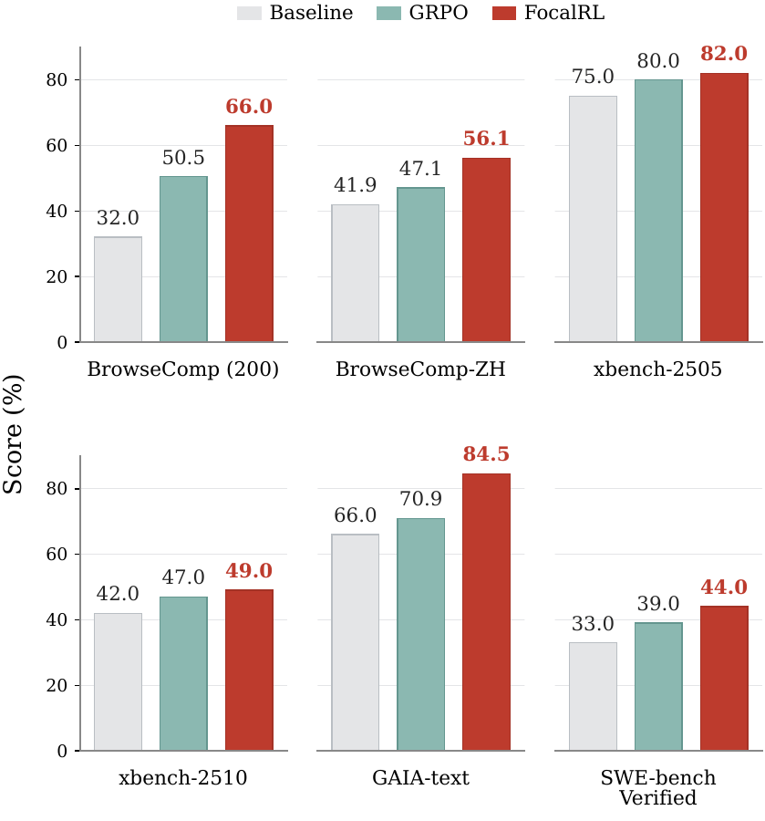
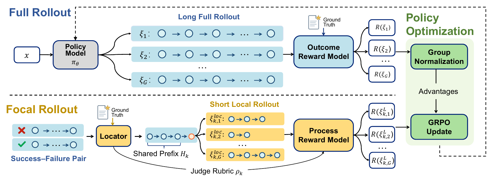
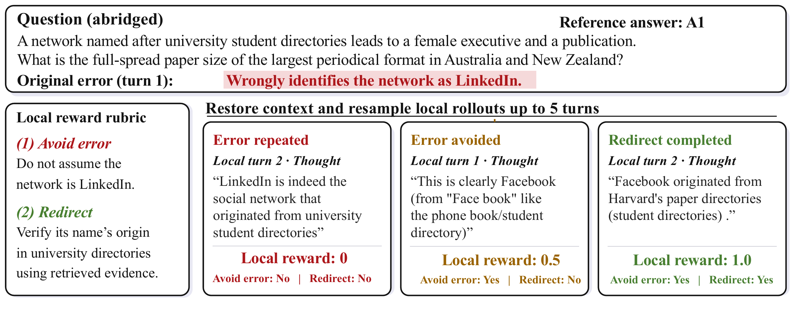

# Focal Credit Assignment for Ultra Long-Horizon Agentic Reinforcement Learning

[Overview](#overview) · [Results](#results) · [Data](#data) · [Getting Started](#getting-started) · [Training](docs/training.md) · [Evaluation](docs/evaluation.md) · [Deep Research](docs/deep_research.md) · [SWE](docs/swe.md)

FocalRL is a simple, general credit assignment method for training long-horizon LLM agents with reinforcement learning. It identifies consequential errors in failed trajectories, resumes from the corresponding pre-error states, and trains on short continuations scored against task-specific repair rubrics.

<p align="center">
  <a href="assets/browsecomp_parameter_scaling.pdf"></a>
  <a href="assets/grpo_vs_horizonfold.pdf"></a>
</p>

## Overview



FocalRL addresses the credit assignment problem through **local action repair**:

1. **Collect full trajectories** and score their task outcomes.
2. **Locate consequential errors** in failed trajectories using successful references, and generate repair rubrics.
3. **Restore and branch** from the pre-error state to sample short continuations.
4. **Score local repairs** for avoiding the error and making the specified correction.
5. **Optimize jointly** with full-trajectory outcome rewards and local repair rewards.

### Local repair rewards

| Avoid the identified error | Make the specified correction | Reward |
| --- | --- | ---: |
| No | — | 0 |
| Yes | No | 0.5 |
| Yes | Yes | 1 |



*In this example, the repair rubric rewards the agent for abandoning an incorrect assumption that the network is LinkedIn and verifying the origin of its name. Each continuation spans at most five assistant turns.*

## Results

### Deep Research

Benchmark scores (%) across five benchmarks:

| Model | Parameters | BrowseComp | BrowseComp-ZH | xbench-2505 | xbench-2510 | GAIA-text |
| --- | ---: | ---: | ---: | ---: | ---: | ---: |
| DR-Venus | 4B | 29.1 | 37.7 | 74.7 | 40.7 | 64.4 |
| AgentCPM-Explore | 4B | 24.1 | 29.1 | 70.0 | 34.0 | 63.9 |
| ABSeeker | 4B | 37.3 | 39.1 | 77.0 | 46.0 | 81.6 |
| **FocalRL-4B** | **4B** | **41.3** | **46.1** | **78.0** | **48.0** | **82.5** |
| WebExplorer-8B-RL | 8B | 15.7 | 32.0 | 53.7 | 23.0 | 50.0 |
| MiroThinker-v1.0-8B | 8B | 31.1 | 40.2 | 60.6 | — | 66.4 |
| **FocalRL-9B** | **9B** | **57.9** | **56.1** | **82.0** | **49.0** | **84.5** |

### Software engineering

Resolved rates (%) with **Qwen3.5-4B**, trained directly from the base model:

| Training | SWE-bench Verified | SWE-bench Lite |
| --- | ---: | ---: |
| Base model | 33.0 | 27.3 |
| GRPO | 39.0 | 31.3 |
| **FocalRL** | **44.0** | **37.7** |

## Data

For Deep Research agents, we construct our training data from [OpenSeeker](https://github.com/PolarSeeker/OpenSeeker) (Du et al., 2026), [RedSearcher](https://github.com/RedSearchAgent/REDSearcher) (Chu et al., 2026), [WebDancer](https://arxiv.org/abs/2505.22648) (Wu et al., 2025), and [DeepDive](https://github.com/THUDM/DeepDive) (Lu et al., 2025a). For SWE agents, we use [SWE-Smith](https://github.com/SWE-bench/SWE-smith) (Yang et al., 2025) as the RL training data.

## Getting Started

### Install and run the CPU tests

Use **Python 3.11 or newer** for the local development environment:

```bash
python -m venv .venv
source .venv/bin/activate
python -m pip install -r requirements-cpu.txt
python -m pytest -q
```

The CPU suite covers trajectory collection, error localization, repair scoring, continuation lengths, environment replay, and training configuration. See [testing](docs/testing.md) for details.

Dependency installation time depends on the network and package cache and cannot be estimated reliably. Pip displays download progress; exit code zero indicates success. Interrupt with Ctrl-C if needed, then rerun to reuse cached downloads.

### Configure training

GPU training uses **Linux, Ray, Megatron, and SGLang**. Follow the [training guide](docs/training.md) to prepare the environment, convert checkpoints, and configure an existing Ray cluster. Then configure the services for your task:

| Task | Policy tools and environment | Setup |
| --- | --- | --- |
| Deep Research | Search, page fetching, browser summarization, and answer judging | [Deep Research guide](docs/deep_research.md) |
| SWE | Harbor-managed containers, native tool execution, replay, and test verification | [SWE guide](docs/swe.md) |

Inspect the training configurations:

```bash
python scripts/launch.py deep_research --describe
python scripts/launch.py swe --describe
```

Follow the [training guide](docs/training.md#preview-and-launch) to prepare checkpoints and data, preview the command, and launch training. It also describes how to monitor progress and manage checkpoints.

### Evaluate checkpoints

Serve a checkpoint with SGLang, then run the evaluation for your task:

| Task | Evaluation entry point | Setup |
| --- | --- | --- |
| BrowseComp / GAIA-text | [Deep Research evaluation](adaptive_branching/shells/eval/run_browsecomp_eval.sh) | [Evaluation guide](docs/evaluation.md#deep-research) |
| SWE-bench Verified / Lite | [SWE evaluation](adaptive_branching/tools/swe/run_lightning_verified.py) | [Evaluation guide](docs/evaluation.md#software-engineering) |

Evaluations save per-task results and support resuming interrupted runs. The [evaluation guide](docs/evaluation.md) describes data preparation, model serving, scoring, and progress monitoring.

## Core Implementation

| Component | Entry point |
| --- | --- |
| Full/local rollout collection | [Shared collector](adaptive_branching/src/deep_research/fully_async_value_cliff_collector.py) |
| Consequential error localization | [Locator](adaptive_branching/src/deep_research/value_cliff_locator.py) |
| Repair rubric and local rewards | [Rubric](adaptive_branching/src/deep_research/value_cliff_rubric.py), [reward evaluation](adaptive_branching/src/deep_research/value_cliff_reward.py) |
| Deep Research agent | [Search/browse agent](adaptive_branching/src/deep_research/agent.py) |
| SWE agent and state restoration | [SWE agent](adaptive_branching/src/swe/lightning_local.py), [environment replay](adaptive_branching/src/swe/lightning_replay.py) |
| Group-centered advantages | [Training data conversion](miles/ray/rollout/train_data_conversion.py) |
| Policy optimization | [Policy loss](miles/backends/training_utils/loss.py) |

## Acknowledgements

FocalRL builds on [Miles](https://github.com/radixark/miles) for rollout generation and policy optimization. We thank the Miles team for their open-source training framework, and the authors of OpenSeeker, RedSearcher, WebDancer, DeepDive, and SWE-Smith for making their work and data publicly available.

## License

The code is distributed under the [Apache-2.0 license](LICENSE).
